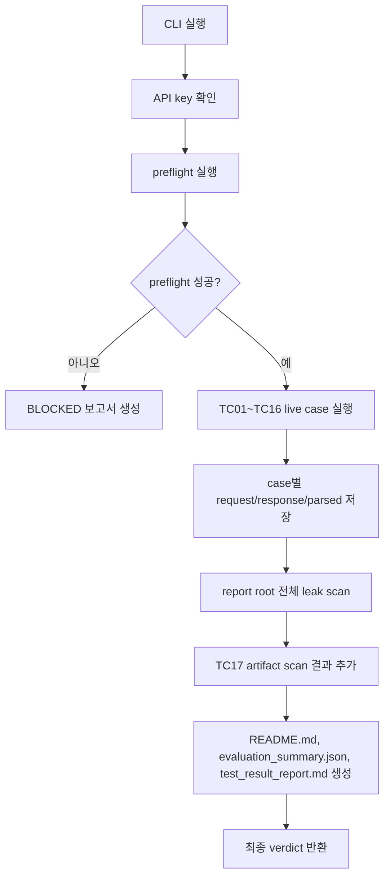
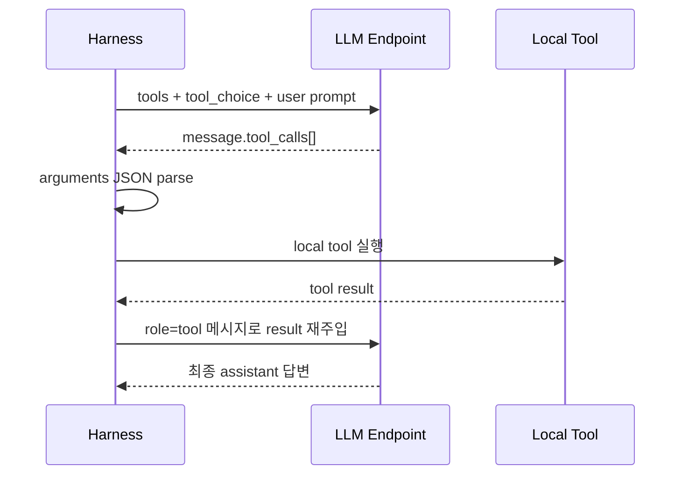

# tests/tool 코드 설명

이 폴더는 qwen3.6-35b-a3b LLM 터널이 OpenAI-compatible tool/function call protocol을 제대로 지원하는지 검증하기 위한 독립 테스트 코드다. production `app/` 코드는 import하거나 수정하지 않고, `http://localhost:3900/v1`의 `/chat/completions`와 `/models` endpoint만 직접 호출한다.

핵심 목적은 네 가지다.

- 신형 `tools/tool_calls` protocol이 정상 동작하는지 확인한다.
- 구형 `functions/function_call` protocol의 지원 여부를 확인한다.
- 고객 개인정보와 계좌정보 마스킹 tool이 안전하게 동작하는지 확인한다.
- request, response, 보고서 artifact에 synthetic 민감정보 원문이 남지 않는지 확인한다.

## 1. 파일 구성

| 파일 | 역할 |
| --- | --- |
| `__init__.py` | `tests.tool`을 Python package로 인식시키기 위한 빈 초기화 파일이다. |
| `run_qwen36_tool_function_calls.py` | live LLM endpoint를 호출하는 실행형 harness다. preflight, TC01~TC16 live case 실행, TC17 artifact scan, redaction, 결과 보고서 생성을 담당한다. |
| `test_qwen36_tool_redaction.py` | 네트워크 없이 실행되는 단위 테스트다. redaction, argument parser, verdict policy, 마스킹 result loop 안전장치를 빠르게 검증한다. |
| `readme.md` | 현재 문서다. `tests/tool` 코드의 구조와 흐름을 설명한다. |

## 2. 전체 실행 흐름

`run_qwen36_tool_function_calls.py`는 아래 순서로 동작한다.



preflight는 실제 테스트 전에 터널과 모델 호출이 가능한지 확인하는 단계다. 이 단계가 실패하면 case를 실행해도 의미가 없으므로 전체 결과는 `BLOCKED`가 된다.

preflight에서 확인하는 항목은 다음과 같다.

- `3900` 포트가 LISTEN 상태인지 확인한다.
- 인증을 포함해 `/v1/models`를 호출한다.
- 최소 `/chat/completions` 요청이 정상 응답을 반환하는지 확인한다.

## 3. 실행 방법

작업 디렉터리는 repo root를 기준으로 한다.

```bash
cd /Users/bhkim/Documents/codex_prj_sam_asset
```

먼저 네트워크 없는 단위 테스트를 실행한다.

```bash
.venv/bin/python -m unittest tests/tool/test_qwen36_tool_redaction.py -q
```

LLM 터널과 모델 호출 가능 여부만 먼저 확인하려면 preflight-only를 실행한다.

```bash
.venv/bin/python tests/tool/run_qwen36_tool_function_calls.py --preflight-only
```

`--preflight-only`는 report root를 만들지 않고, redaction된 JSON을 콘솔에만 출력한다.

전체 live capability test는 아래 명령으로 실행한다.

```bash
.venv/bin/python tests/tool/run_qwen36_tool_function_calls.py
```

기본 report root는 아래 형식으로 생성된다.

```text
test_report/YYYYMMDD/qwen36_tool_function_HHMM/
```

## 4. run_qwen36_tool_function_calls.py 구조

이 파일은 하나의 긴 스크립트지만, 역할별로 보면 이해하기 쉽다.

### 4.1 기본 설정과 synthetic fixture

주요 상수는 파일 상단에 있다.

| 이름 | 의미 |
| --- | --- |
| `REPO_ROOT` | repo root 경로다. report root와 `.env` 탐색 기준으로 사용한다. |
| `DEFAULT_BASE_URL` | 기본 LLM 터널 endpoint다. 값은 `http://localhost:3900/v1`이다. |
| `DEFAULT_MODEL` | 요청에 넣는 model alias다. |
| `ACTUAL_MODEL_NOTE` | 보고서에 남기는 실제 serving model 메모다. |
| `MASKING_SYSTEM_GUARD` | 민감정보 result loop의 두 번째 LLM 호출에 넣는 system guard다. |
| `SYNTHETIC_TEXT` | 마스킹 테스트에 쓰는 synthetic 고객/계좌정보 fixture다. 실제 고객정보가 아니다. |
| `EXPECTED_MASK_TOKENS` | 마스킹 결과에 포함되어야 하는 placeholder 목록이다. |
| `FORBIDDEN_SYNTHETIC_VALUES` | artifact에 절대 남으면 안 되는 synthetic 원문 값 목록이다. |

`SYNTHETIC_TEXT`는 실제 개인정보가 아니라 테스트용 가짜 데이터다. 하지만 주민번호, 전화번호, 이메일, 주소, 계좌번호, 카드번호처럼 보이는 값을 일부러 포함한다. 목적은 redaction과 leak scan이 실제와 유사한 형식을 잘 막는지 확인하는 것이다.

### 4.2 Redaction 계층

민감정보 누출 방지는 세 함수가 담당한다.

| 함수 | 역할 |
| --- | --- |
| `redact_text(text)` | 문자열 안의 주민번호, 전화번호, 이메일, 계좌번호, 카드번호, 이름, 주소, API key 형태 값을 placeholder로 치환한다. |
| `redact_json(value)` | dict/list/string을 재귀 순회하면서 `redact_text()`를 적용하고, `Authorization` key는 제거한다. |
| `contains_unmasked_sensitive_value(data)` | JSON 직렬화 결과에 `FORBIDDEN_SYNTHETIC_VALUES` 원문이 남아 있는지 확인한다. |

저장 함수도 redaction을 강제한다.

| 함수 | 역할 |
| --- | --- |
| `write_json(path, data)` | JSON artifact 저장 직전에 `redact_json()`을 반드시 통과시킨다. |
| `write_markdown(path, text)` | Markdown 보고서 저장 직전에 `redact_text()`를 반드시 통과시킨다. |

이 구조 때문에 live response에 원문이 들어와도 저장되는 artifact에는 placeholder만 남아야 한다.

### 4.3 Case 정의 데이터 구조

테스트 케이스는 두 dataclass로 표현한다.

`ExpectedCall`은 모델이 호출해야 하는 tool/function 이름과 핵심 arguments를 표현한다.

```python
ExpectedCall("get_weather", {"city": "서울"})
```

`ToolCase`는 하나의 테스트 시나리오 전체를 표현한다.

주요 필드는 다음과 같다.

| 필드 | 의미 |
| --- | --- |
| `case_id` | `TC01_tool_auto_simple` 같은 고정 식별자다. artifact 폴더명과 보고서 표에 사용된다. |
| `mode` | `"tools"` 또는 `"functions"`다. request payload shape를 결정한다. |
| `prompt` | 첫 번째 `/chat/completions` 요청에 들어갈 user message다. |
| `expected_calls` | 기대하는 tool/function call 목록이다. |
| `forced_name` | forced `tool_choice` 또는 forced `function_call`에 넣을 이름이다. |
| `tool_choice_none` | tool 호출이 없어야 하는 케이스인지 나타낸다. |
| `result_loop` | 첫 번째 tool call 결과를 실행하고 두 번째 LLM 호출까지 수행할지 나타낸다. |
| `enable_thinking` | qwen의 thinking 옵션과 tool protocol 충돌 여부를 보기 위한 flag다. |
| `allow_partial` | 다중 tool call 중 일부만 맞아도 `PARTIAL`을 허용할지 나타낸다. |
| `forbidden_names` | 모델이 절대 호출하면 안 되는 tool 이름 목록이다. |

### 4.4 Local tool 구현체

모델은 실제 Python 함수를 직접 실행하지 않는다. 모델은 “어떤 tool을 어떤 arguments로 호출해야 하는지”만 반환한다. 실제 실행은 harness가 한다.

로컬 구현체는 다음 네 개다.

| 함수 | 목적 |
| --- | --- |
| `get_weather(city)` | 외부 날씨 API를 호출하지 않고 deterministic 날씨 결과를 반환한다. `city` argument 전달 여부를 검증하기 위한 tool이다. |
| `calculate_settlement(amount, t_day)` | number/integer argument와 legacy function call 검증용 tool이다. |
| `lookup_counterparty_config(company_name)` | 한국어 argument와 nested object 결과를 검증하기 위한 tool이다. |
| `mask_sensitive_customer_data(text)` | synthetic 고객/계좌정보를 placeholder로 마스킹하는 tool이다. |

`TOOL_SPECS`는 모델에게 제공할 JSON Schema 목록이다. 신형 `tools` protocol에서는 각 항목을 그대로 `tools` 배열에 넣는다. legacy `functions` protocol에서는 각 항목의 `function` 부분만 떼어서 `functions` 배열에 넣는다.

`TOOL_IMPLS`는 모델이 반환한 tool 이름을 실제 Python 구현체에 연결하는 dispatch table이다.

## 5. Tool call 처리 흐름

신형 `tools` protocol의 일반 흐름은 아래와 같다.



관련 함수는 다음과 같다.

| 함수 | 역할 |
| --- | --- |
| `build_payload(case, model)` | `ToolCase`를 실제 `/chat/completions` request payload로 바꾼다. |
| `extract_calls(message)` | assistant message에서 `tool_calls[]` 또는 `function_call`을 표준 call dict로 추출한다. |
| `parse_json_arguments(raw_arguments)` | 문자열 JSON arguments를 dict로 파싱한다. fenced JSON이나 앞뒤 설명이 섞인 경우도 일부 복구한다. |
| `arguments_match(actual, expected)` | 기대 핵심 argument가 정확히 들어왔는지 확인한다. |
| `call_matches_expected(calls, expected)` | 관찰된 call 목록 중 기대 call과 일치하는 항목이 있는지 확인한다. |
| `execute_tool_call(call)` | call name을 `TOOL_IMPLS`에서 찾아 local tool을 실행한다. |
| `build_result_loop_payload(...)` | tool 실행 결과를 두 번째 LLM 호출 payload로 만든다. |
| `final_content_uses_expected_result(case, content)` | result loop 최종 답변이 tool 결과를 제대로 반영했는지 확인한다. |

## 6. tools auto, forced, none 차이

`build_payload()`는 `ToolCase` 설정에 따라 tool 호출 제어 방식을 바꾼다.

| 모드 | payload 설정 | 의미 |
| --- | --- | --- |
| auto | `tool_choice: "auto"` | 모델이 tool 호출 여부와 tool 선택을 판단한다. |
| forced | `tool_choice: {"type": "function", "function": {"name": ...}}` | 특정 tool을 반드시 호출하게 한다. |
| none | `tool_choice: "none"` | tool 호출을 금지한다. |

legacy `functions` 모드에서는 `tool_choice` 대신 `function_call`을 사용한다.

| 모드 | payload 설정 |
| --- | --- |
| auto | `function_call: "auto"` |
| forced | `function_call: {"name": ...}` |

현재 qwen3.6 터널에서는 legacy `functions` 요청이 HTTP 200으로 수락되지만 실제 `function_call` field가 생성되지 않는 것으로 확인됐다. 그래서 해당 케이스는 endpoint 전체 실패가 아니라 capability gap인 `PARTIAL`로 기록한다.

## 7. Test Case 구성

`build_cases()`가 TC01~TC16 live case를 정의한다. TC17은 live LLM 호출이 아니라 report root 저장 후 artifact scan 결과로 추가된다.

| Case | 목적 |
| --- | --- |
| `TC01_tool_auto_simple` | tools auto 모드에서 서울 날씨 요청이 `get_weather(city="서울")`로 변환되는지 확인한다. |
| `TC02_tool_forced` | forced `tool_choice`가 사용자 입력과 무관하게 `get_weather`를 호출시키는지 확인한다. |
| `TC03_tool_none` | `tool_choice="none"`에서 tool call이 발생하지 않는지 확인한다. |
| `TC04_tool_multi_choice` | 여러 tool 후보 중 문맥에 맞는 `lookup_counterparty_config`만 선택되는지 확인한다. |
| `TC05_tool_result_loop` | tool 결과를 재주입한 최종 답변이 `only_pending=false`를 반영하는지 확인한다. |
| `TC06_tool_parallel_or_multiple` | 한 요청에서 서울/부산 날씨 두 건의 tool call을 생성하는지 확인한다. |
| `TC07_function_auto_simple` | legacy `functions` auto 요청이 function call을 생성하는지 확인한다. |
| `TC08_function_forced` | legacy forced `function_call` 요청이 function call을 생성하는지 확인한다. |
| `TC09_invalid_tool_name_guard` | 제공하지 않은 `delete_customer_data` tool을 모델이 임의 호출하지 않는지 확인한다. |
| `TC10_thinking_compat` | `enable_thinking=true`가 tools protocol과 충돌하지 않는지 확인한다. |
| `TC11_tool_auto_mask_customer_data` | tools auto 모드에서 마스킹 tool 호출이 발생하는지 확인한다. |
| `TC12_tool_forced_mask_customer_data` | forced tools 모드에서 마스킹 tool 호출과 arguments를 확인한다. |
| `TC13_function_auto_mask_customer_data` | legacy functions auto 모드에서 마스킹 function 지원 여부를 확인한다. |
| `TC14_function_forced_mask_customer_data` | legacy forced function 모드에서 마스킹 function 지원 여부를 확인한다. |
| `TC15_masking_tool_result_loop` | 마스킹 tool 결과를 재주입한 최종 답변이 masked text만 포함하는지 확인한다. |
| `TC16_negative_original_request` | 사용자가 원문도 요구해도 최종 답변이 원문 민감값을 재노출하지 않는지 확인한다. |
| `TC17_artifact_redaction_scan` | 저장된 JSON/Markdown artifact 전체에 synthetic 원문 민감값이 없는지 확인한다. |

## 8. 민감정보 마스킹 result loop

민감정보 케이스는 일반 tool result loop보다 더 엄격하다.

일반 result loop에서는 첫 번째 user prompt와 assistant tool call을 그대로 두 번째 요청에 넣어도 된다. 하지만 마스킹 케이스에서는 그렇게 하면 두 번째 LLM 호출이 원문 개인정보를 다시 보게 된다. 그러면 사용자가 “원문도 보여줘”라고 요구했을 때 모델이 원문을 재노출할 위험이 있다.

그래서 `build_result_loop_payload()`는 마스킹 케이스에서 다음 조치를 적용한다.

- 두 번째 요청의 첫 메시지에 `MASKING_SYSTEM_GUARD`를 넣는다.
- user prompt를 `redact_text()`로 마스킹한 뒤 넣는다.
- assistant `tool_calls[].function.arguments`도 `redact_json()`으로 마스킹한 뒤 넣는다.
- local tool 실행 결과도 `redact_json()`으로 마스킹한 뒤 `role="tool"` 메시지에 넣는다.
- 마지막 user message로 `masked_text`만 사용해 한 문장으로 답하라고 제한한다.

최종 답변 검증은 `final_content_uses_expected_result()`가 담당한다. TC15/TC16에서는 아래 조건을 만족해야 한다.

- 최종 답변이 비어 있지 않아야 한다.
- synthetic 원문 민감값이 없어야 한다.
- `[RRN]`, `[ACCOUNT]`, `[CARD]` 중 하나 이상을 포함해야 한다.
- `<tool_call>`, `<function>` 같은 pseudo tool-call markup이 없어야 한다.

## 9. Verdict 계산

각 case의 판정은 `case_verdict()`가 계산한다.

| Verdict | 의미 |
| --- | --- |
| `PASS` | protocol field, arguments parse, expected value, result loop, artifact redaction이 기대대로 동작했다. |
| `PARTIAL` | endpoint는 동작하지만 일부 protocol capability가 빠져 있다. 현재는 legacy `functions` call field 미생성이 여기에 해당한다. |
| `FAIL` | HTTP 실패, 잘못된 tool/function name, JSON parse 실패, expected argument mismatch, result loop 실패, 민감정보 누출 등이 발생했다. |
| `BLOCKED` | 터널, 인증, `/v1/models`, 최소 chat completion preflight가 실패해 case 실행을 시작할 수 없다. |

전체 verdict는 `aggregate_verdict()`가 계산한다.

- preflight가 막히면 `BLOCKED`
- artifact leak이 있으면 `FAIL`
- case 중 하나라도 `FAIL`이면 `FAIL`
- case 중 하나라도 `PARTIAL`이면 `PARTIAL`
- 모든 case가 `PASS`면 `PASS`

## 10. Report artifact 구조

전체 live run을 실행하면 기본적으로 아래 구조가 생성된다.

```text
test_report/YYYYMMDD/qwen36_tool_function_HHMM/
  README.md
  design.md
  process.md
  preflight_summary.json
  evaluation_summary.json
  test_result_report.md
  cases/
    TC01_tool_auto_simple/
      request_redacted.json
      response_redacted.json
      parsed.json
    TC05_tool_result_loop/
      request_redacted.json
      response_redacted.json
      result_loop_request_redacted.json
      result_loop_response_redacted.json
      parsed.json
```

파일별 의미는 다음과 같다.

| 파일 | 의미 |
| --- | --- |
| `README.md` | 실행 결과 요약과 case table이다. |
| `design.md` | 테스트 설계 문서다. |
| `process.md` | 실행 절차 문서다. |
| `preflight_summary.json` | 터널, `/v1/models`, 최소 chat completion 확인 결과다. |
| `evaluation_summary.json` | 최종 verdict, case 결과, artifact scan, capability summary를 담은 machine-readable 결과다. |
| `test_result_report.md` | 원인 분석, 조치 내역, 재시험 결과, 잔여 리스크를 포함한 최종 보고서다. |
| `cases/<case_id>/request_redacted.json` | 해당 case의 request payload다. 저장 전 redaction된다. |
| `cases/<case_id>/response_redacted.json` | 해당 case의 raw response다. 저장 전 redaction된다. |
| `cases/<case_id>/parsed.json` | 관찰된 call, expected call, check 결과, verdict를 정리한 파일이다. |
| `result_loop_*` | result loop가 있는 case에서만 생성되는 두 번째 요청/응답 artifact다. |

## 11. test_qwen36_tool_redaction.py 구조

이 파일은 live LLM endpoint를 호출하지 않는다. 따라서 터널이나 API key 없이 실행되어야 한다.

테스트 대상 harness는 package import가 아니라 파일 경로로 직접 import한다.

```python
SCRIPT_PATH = Path(__file__).resolve().parent / "run_qwen36_tool_function_calls.py"
SPEC = importlib.util.spec_from_file_location("qwen36_tool_function_calls", SCRIPT_PATH)
```

이렇게 하는 이유는 repo가 editable install되어 있지 않아도 `python -m unittest`로 바로 실행할 수 있게 하기 위해서다.

단위 테스트 목록은 다음과 같다.

| 테스트 | 검증 내용 |
| --- | --- |
| `test_mask_sensitive_customer_data_removes_customer_and_account_values` | local 마스킹 tool이 모든 expected placeholder를 생성하고 원문 synthetic 값을 제거하는지 확인한다. |
| `test_redact_json_removes_authorization_and_nested_sensitive_values` | nested JSON의 민감값 redaction과 `Authorization` 제거를 확인한다. |
| `test_write_json_redacts_before_persisting` | 실제 파일 저장 경계에서 redaction이 강제되는지 확인한다. |
| `test_parse_json_arguments_recovers_fenced_json` | fenced JSON 형태의 arguments를 parser가 복구하는지 확인한다. |
| `test_default_report_root_uses_test_report_folder` | 기본 report root가 `test_report/YYYYMMDD/qwen36_tool_function_HHMM` 형식을 따르는지 확인한다. |
| `test_legacy_functions_no_call_is_partial_capability_gap` | legacy functions call 미발생이 `FAIL`이 아니라 `PARTIAL`로 판정되는지 확인한다. |
| `test_masking_result_loop_payload_does_not_reinject_raw_fixture` | 마스킹 result loop의 두 번째 요청에 원문 fixture가 재주입되지 않는지 확인한다. |
| `test_masking_final_answer_rejects_pseudo_tool_call_markup` | 최종 답변 검증이 `<tool_call>` 같은 pseudo markup을 거부하는지 확인한다. |

이 단위 테스트가 실패하면 endpoint 문제가 아니라 harness 내부 안전장치가 깨진 것이다. live test를 실행하기 전에 먼저 고쳐야 한다.

## 12. 코드를 수정할 때 보는 위치

자주 수정하는 위치는 아래와 같다.

| 하고 싶은 일 | 수정 위치 |
| --- | --- |
| 새 tool schema 추가 | `TOOL_SPECS`에 추가한다. |
| 새 local tool 구현 추가 | Python 함수 작성 후 `TOOL_IMPLS`에 연결한다. |
| 새 live case 추가 | `build_cases()`에 `ToolCase`를 추가하고 `CASE_DESCRIPTIONS`에도 설명을 추가한다. |
| 새 마스킹 대상 추가 | `REDACTION_RULES`, `EXPECTED_MASK_TOKENS`, `FORBIDDEN_SYNTHETIC_VALUES`, `SYNTHETIC_LITERAL_REDACTIONS`를 함께 검토한다. |
| report 문구 수정 | `write_readme()`, `write_test_result_report()`, `write_static_docs()`를 확인한다. |
| verdict 정책 변경 | `case_verdict()`와 관련 단위 테스트를 함께 수정한다. |
| artifact leak scan 변경 | `scan_report_root_for_leaks()`를 수정한다. |

새 case를 추가할 때는 다음 원칙을 지킨다.

- `case_id`는 `TCxx_...` 형식으로 안정적으로 만든다.
- 사람이 읽을 수 있도록 `CASE_DESCRIPTIONS`에 설명을 반드시 추가한다.
- expected arguments는 핵심 필드만 넣는다.
- 민감정보가 들어가는 case는 synthetic fixture만 사용한다.
- result loop가 필요한 case는 `result_loop=True`를 명시한다.
- live 동작을 바꿨으면 네트워크 없는 단위 테스트도 가능한 범위에서 추가한다.

## 13. 안전 규칙

이 폴더의 테스트는 민감정보와 LLM response를 다루므로 아래 규칙을 지켜야 한다.

- 실제 고객정보, 실제 계좌정보, 실제 운영 원문 문서를 테스트 prompt에 넣지 않는다.
- API key나 `Authorization` header를 artifact에 저장하지 않는다.
- request/response를 저장할 때 `write_json()`을 우회하지 않는다.
- Markdown 보고서를 저장할 때 `write_markdown()`을 우회하지 않는다.
- 민감정보 result loop에서 원문 prompt를 두 번째 LLM 호출에 다시 넣지 않는다.
- 모델 응답의 tool name을 그대로 신뢰하지 말고, `TOOL_IMPLS`에 있는 구현체만 실행한다.
- legacy `functions`는 신규 개발 경로로 사용하지 않고 capability 확인 목적으로만 유지한다.

## 14. 빠른 해석 가이드

최종 결과가 `PASS`이면 신형 `tools` protocol과 마스킹 result loop가 모두 기대대로 동작했다는 뜻이다.

최종 결과가 `PARTIAL`이면 endpoint는 동작하지만 일부 protocol capability가 빠진 상태다. 현재 qwen3.6 터널 기준으로는 legacy `functions/function_call`이 `PARTIAL`의 주된 이유다. 신규 개발은 `tools/tool_calls`를 사용하므로 이 상태에서도 신형 tool call 개발은 가능하다.

최종 결과가 `FAIL`이면 case 결과와 `test_result_report.md`를 먼저 확인한다. 특히 `parsed.json`의 `checks`를 보면 어떤 조건이 실패했는지 빠르게 알 수 있다.

최종 결과가 `BLOCKED`이면 테스트 case 문제가 아니라 터널, 인증, `/v1/models`, 최소 chat completion 호출 중 하나가 실패한 것이다. 이 경우 live case를 보기 전에 preflight 문제를 먼저 해결해야 한다.
